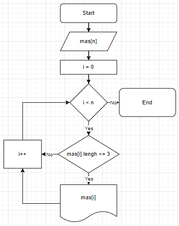

# Задача

Написать программу, которая из имеющегося массива строк формирует новый массив из строк, длина которых ***меньше, либо равна 3*** символам. Первоначальный массив можно ввести с клавиатуры, либо задать на старте выполнения алгоритма.

## Решение

Задается массив строк. С помощью цикла for обходим этот массив и, если длина строки меньше или равно 3, выводим данную строку на экран, тк нет необходимости запоминать строки.  
Для коректной работы программы перед началом её работы задается размер массива n. Массив строк будет объявлен переменной mas[n].  
При обходе массива для определения длины строки будет использоваться команда **mas[i].Lengh**.  
В таком случае проверка на длину строки будет выглядеть подобным образом:

```C#
lengh = mas[i].Lengh;
if(lengh <= 3)
    Console.Write(mas[i])
```

## Диаграмма

На картинке ниже представлена диаграмма решения данной задачи.



## Программа

Решение задачи на языке C# представлено в файле ***Program.cs***.  
